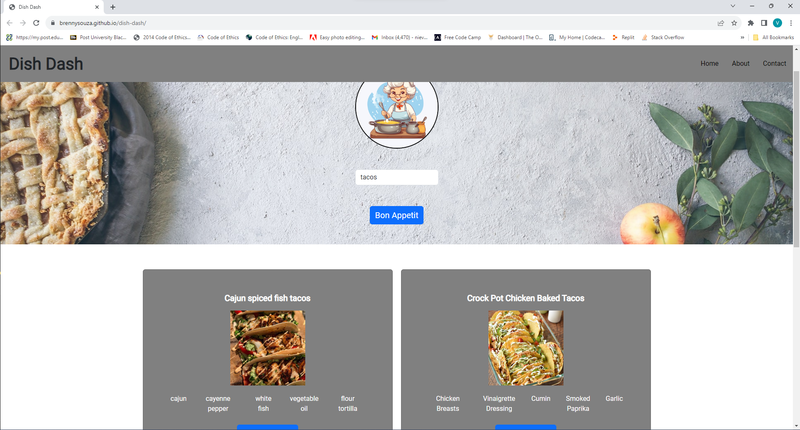
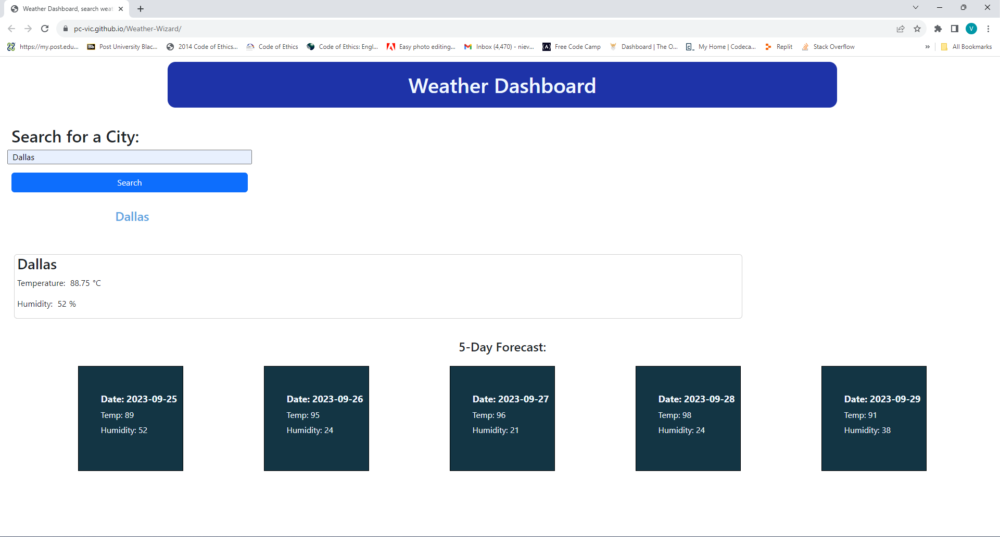
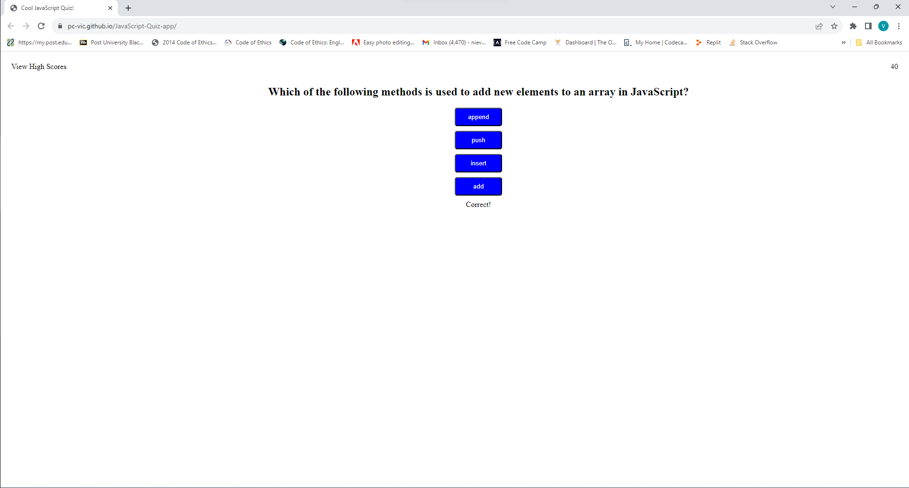

# My Portfolio

Welcome to my portfolio website! This website showcases my web development projects and provides a glimpse into my skills and interests as a web developer.

## Table of Contents

- [My Portfolio](#my-portfolio)
  - [Table of Contents](#table-of-contents)
  - [About Me](#about-me)
  - [Projects](#projects)
    - [Dish Dash](#dish-dash)
    - [Weather Wizard](#weather-wizard)
    - [Cool Quiz App](#cool-quiz-app)
    - [Password Gen](#password-gen)
  - [Technologies Used](#technologies-used)
  - [Getting Started](#getting-started)
  - [Feedback and Contact](#feedback-and-contact)

## About Me

I am a passionate web developer with a love for creating interactive and user-friendly web applications. I am enthusiastic about learning new technologies and solving real-world problems through code.

## Projects

### Dish Dash

[Dish Dash](https://brennysouza.github.io/dish-dash/) is a web application that allows users to search for recipes by entering keywords. It provides a convenient way to discover new dishes and cooking ideas.

*Dish Dash lets you search fro recipes connected to The Meal DB API*

### Weather Wizard

[Weather Wizard](https://pc-vic.github.io/Weather-Wizard/) is a weather app that fetches weather information for a user-specified city using a weather API. Stay informed about the weather conditions wherever you are.

*Search live weather data by city with Weather Wizard*

### Cool Quiz App

[Cool Quiz App](https://pc-vic.github.io/JavaScript-Quiz-app/) is a fun and challenging timed quiz application that tests your knowledge of JavaScript. How well do you know JavaScript? Find out with this quiz!

*A timed quiz created with JavaScript*

### Password Gen

[Password Gen](https://pc-vic.github.io/Password-Gen/) is a password generator app that helps you create secure and customized passwords. You can specify various preferences, including length, character types, and more.

*A password generator that helps the user create a password up to 128 characters long!*

## Technologies Used

- HTML
- CSS
- JavaScript

## Getting Started

To explore my portfolio website and the projects, simply visit [Portfolio Website](https://pc-vic.github.io/My-Portfolio/).

## Feedback and Contact

I'm always open to feedback and collaborations. If you have any suggestions, questions, or would like to work together on a project, feel free to reach out to me at [nievesvic86@gmail.com](mailto:nievesvic86@gmail.com).

Thank you for visiting my portfolio! 😊
 

